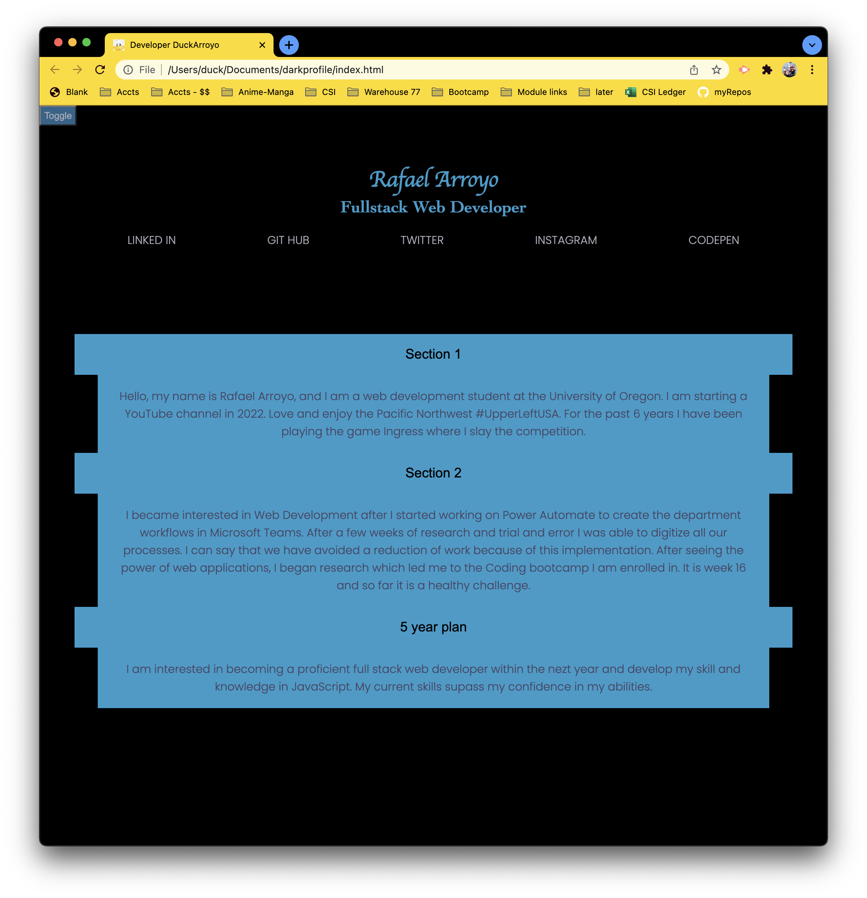
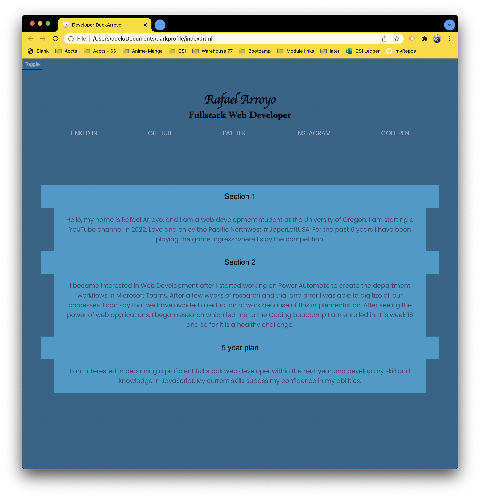

# darkprofile 

## Description

Project to test out a button activated dark mode version of a page. There is a secondary test of an accordion style display. 

## Project Guidelines/Requirements

None

# Contributions by:

DeveloperDuckArroyo

[Portfolio](https://duckarroyo.github.io/challenge2/)

[GitHub](https://github.com/DuckArroyo)

[Twitter @DevDuckArroyo](https://twitter.com/DevDuckArroyo)

[LinkeIn](https://www.linkedin.com/in/duckarroyo/)

[CodePen](https://codepen.io/DeveloperDuckArroyo)

# Screnshots

